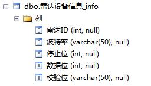

# Bio-radar Serial Host Computer

## 简介

   1. 该上位机的操作对象是珠海奥美科技有限公司的白色单人版非接触式体征检测**生物雷达BR01模块**，进行生命体征检测的显示。该模块5V供电，利用有线USB串口与笔记本或者PC机连接显示调试。
   
   2. 同时连接本地的**SQL Server 2008 **数据库进行异常信息的存入和读取。
   
   3. 该上位机工具是在参考 [SerialAsst](https://github.com/c-my/SerialAsst) 串口调试工具之后的作品 
   
## 预览

### 1. 原始的调试工具
   
  

### 2. 生物雷达的显示上位机
   
  

## 功能
   
  1. **多模块并行工作**: 该工具为每一个生物雷达模块建立一个独立的线程，使其相互独立而不互相影响，最多可以同时容纳4个模块同时工作。
  
  2. 该工具可以采集每个生物雷达模块的生命体征信息: 包括**呼吸数据和心率数据**。并且以实时数据波形的形式和具体数值的形式显示在相应的位置。具体效果如上图所示。
  
  3. **异常数据的存储**： 当心率数据小于40的时候或者呼吸数据小于10的时候认为是数据异常（这里的40和10是事先存储在SQL Server 2008 的数据库里面的，需要通过查询数据库来获得雷达的异常阈值）。并将异常数据触发的时间和次数写入得到数据库的异常信息表里面。
  
## SQL Server 2008数据库部分

### 针对该上位机工具，一共建立了一个数据库和四张数据表，分别是：

  1. 四张数据表的总体视图

   

  2. 床位表的视图
      
   

  3. 雷达设备信息表视图

   

  4. 雷达阈值信息视图

   

  5. 数据异常信息表的视图

   
